# 🍀운빨 랜덤 디펜스🍀

24.03.25 ~ 23.04.23 

## 서비스 소개

<b>🍀행운🍀을 올려 슬라임들을 저지하고 승리하세요! </b>
  

## 다운로드

#### [Android 🎮🕹️ DownLoad(원 스토어 Link)](https://m.onestore.co.kr/mobilepoc/apps/appsDetail.omp?prodId=0000775718)

## 플레이 영상
### 플레이
[플레이 영상](https://www.youtube.com/watch?v=VJvAs3x-4Mg)
 

## 개요
행운과 능력치를 올려 끊임없이 공격해오는 슬라임들을 저지하세요!

## 서비스 특징
1. 어렵지 않은 조작으로 누구나 쉽게 플레이
2. 귀엽고 심플한 캐릭터로 친근함 Up
3. 랜덤성 요소로 플레이 플레이마다 다른 재미를 느낄 수 있음

## 게임 진행
#### 각 라운드의 시작까지 15초의 🕑준비 시간🕑이 있습니다. 
#### 5라운드마다 더 강력한 ☠️보스 몬스터☠️가 나옵니다. 
#### 총 45라운드까지 있으며 모든 몬스터를 저지하면 🏆승리🏆합니다. 
#### 몬스터를 저지하기 전에 Player의 체력이 0이 되면 ❌패배❌합니다. 

## 기능별 화면 

## 메인 페이지

접기/펼치기

### MainPage

### Tutorial
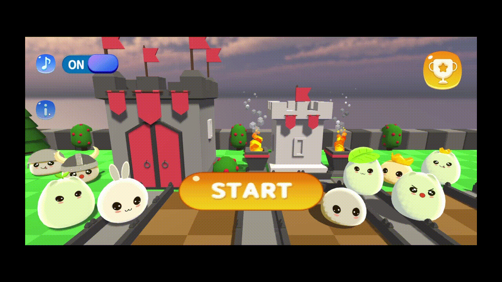

### BGM On&Off

### Rank Record

### GameStart

## 게임 플레이

접기/펼치기

### 타워 구매

### Player 능력 Upgrade
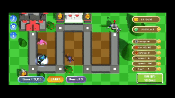

### Tower 선택
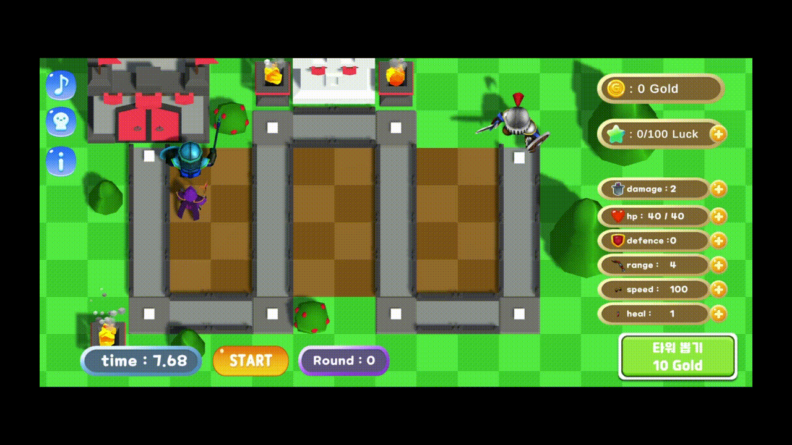

### Tower Drag&Drop
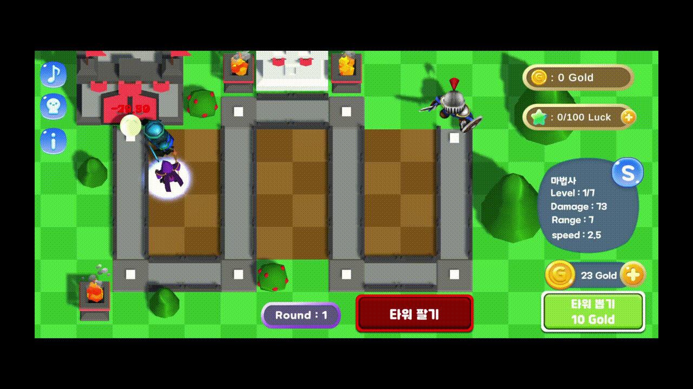

### Tower Change
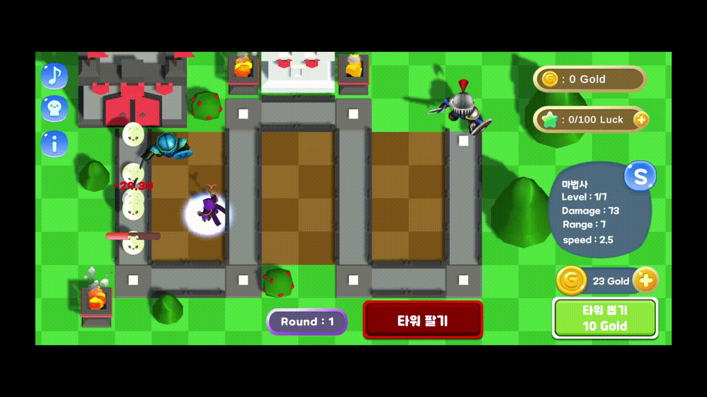

### Tower Seat
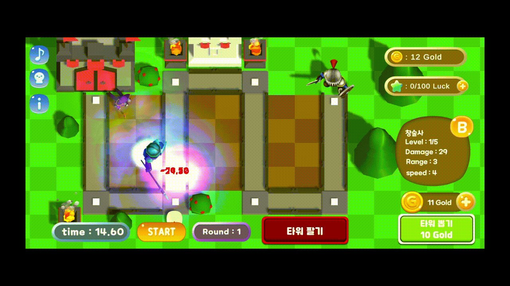

### Tower Upgrade
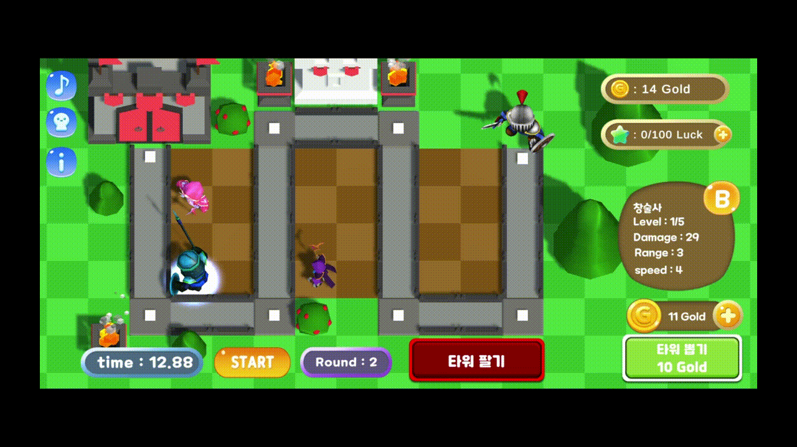

### Tower 판매
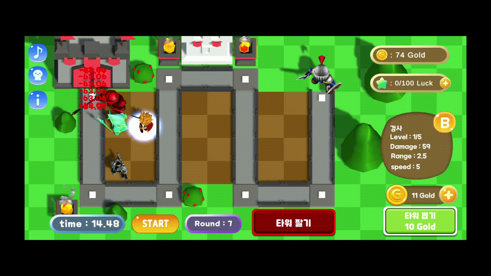

### Monster Information
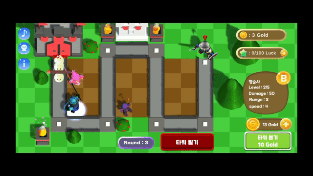

### Game Clear

### Game Over

## Tower 종류

접기/펼치기

## 검사
### 검사 (B)
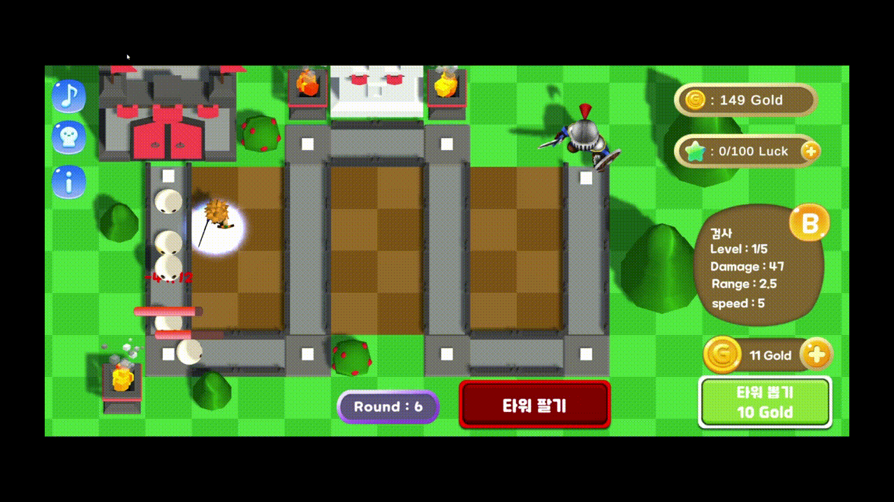

### 검사 (A)
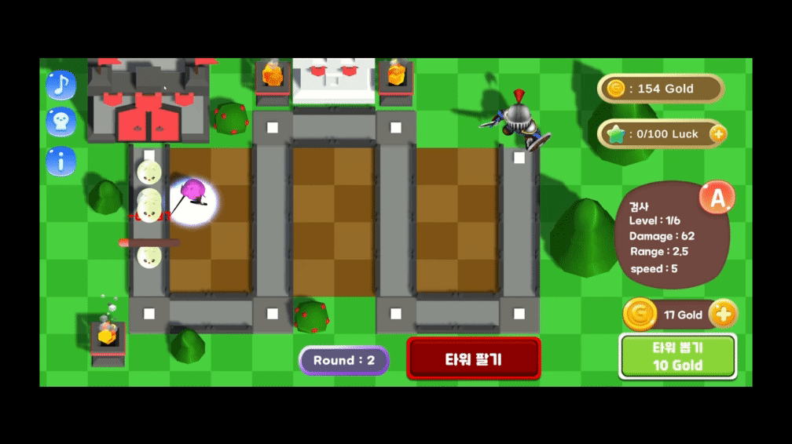

### 검사 (S)
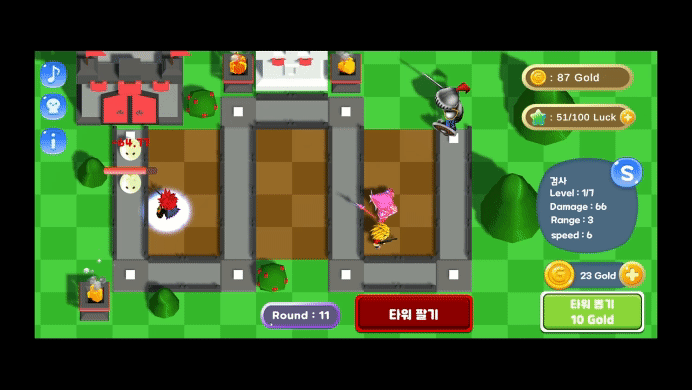

## 창술사
### 창술사 (B)
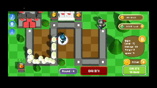

### 창술사 (A)
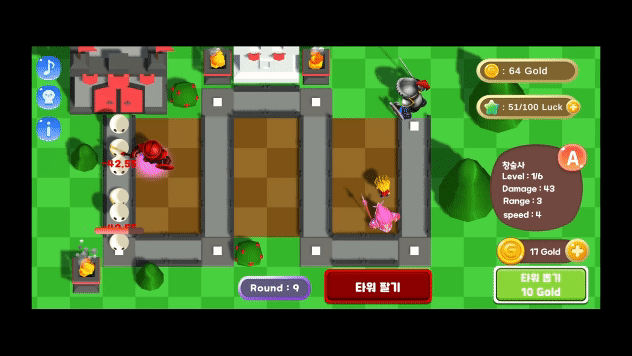

### 창술사 (S)

## 마법사
### 마법사 (B)

### 마법사 (A)

### 마법사 (S)

## 총잡이
### 총잡이 (B)
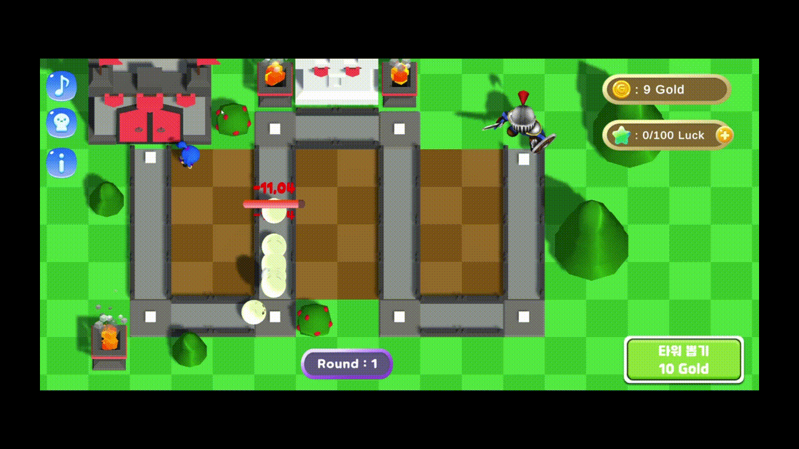

### 총잡이 (A)
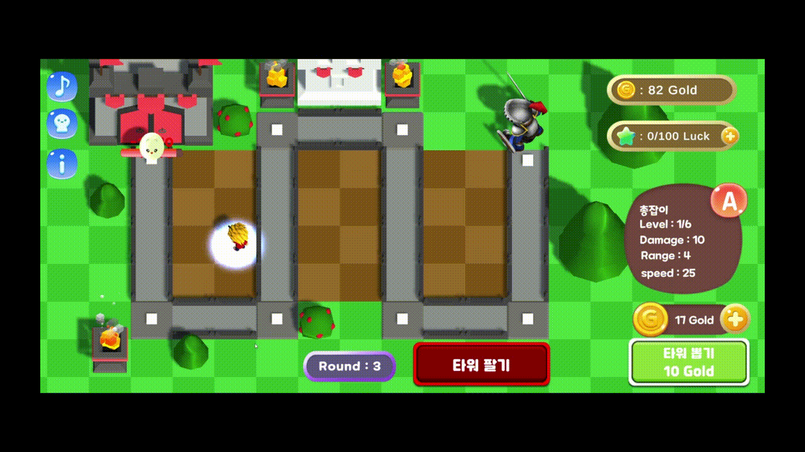

### 총잡이 (S)

## 흑마법사(광역)
### 흑마법사 (B)

### 흑마법사 (A)
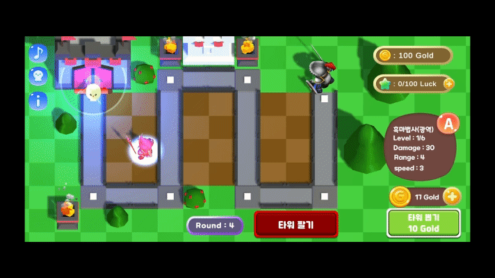

### 흑마법사 (S)

---

## 개발 환경
### Game Engine
- Unity Engine
- C#

### Data File 관리
- Google Spread Sheet (CSV)
 
 

## 구현 내용 (1인 개발)
<strong>손임현</strong>
- UI
 > Play UI 
 > Main Page UI 
 > UI 비율 고정 
 > 게임 설명 UI 

- Game
 > Tower 공격, Monster 공격 기능 구현 
 > Tower, Player Upgrade 기능 구현 
 > Tower Drag & Drop 기능 구현 
 > Tower 생성 및 판매 기능 구현 
 > Round 시작 & Skip 기능 구현 
 > Tower & Monster 생성 기능 구현 
 > Tower & Monster Info 기능 구현 

- Google AdMob
 > 광고 시청 후 Play 시작 -> (원스토어로 변경 후 광고 기능 삭제) 

- Data
 > playerprefs로 이전 플레이 정보 & 세팅 정보 저장 기능 구현 
 > 게임 시작 시 Data Road 구현 (CSV 파일) 
